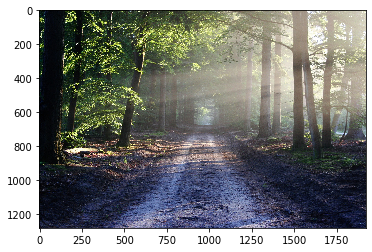
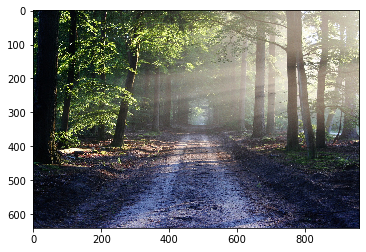
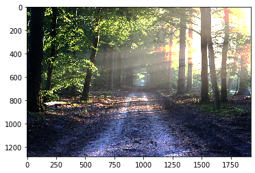
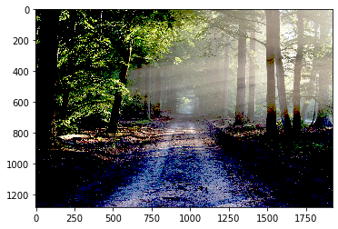

# Numpy

[Cheatsheet](https://s3.amazonaws.com/assets.datacamp.com/blog_assets/Numpy_Python_Cheat_Sheet.pdf)

## Basic Numpy


{:.input_area}
```python
import numpy as np
```


### Create array


{:.input_area}
```python
# empty array np.empty(<shape>)
np.empty((3,2))
```


{:.output .output_data_text}
```
array([[1.57292083e-316, 0.00000000e+000],
       [0.00000000e+000, 0.00000000e+000],
       [0.00000000e+000, 0.00000000e+000]])
```


{:.input_area}
```python
# np.linspace(start, stop, len)
# similar to R: seq(from, to, by)
print(
    np.linspace(1, 5, 5),
    np.linspace(1, 5, 3),
    sep = '\n')
```


{:.output .output_stream}
```
[1. 2. 3. 4. 5.]
[1. 3. 5.]

```


{:.input_area}
```python
# np.arange(start, stop, step)
# equivalent to R: seq(from, to, by)
print(
    np.arange(5),        # stop
    np.arange(1, 5),     # start, stop
    np.arange(1, 6, 2),  # start, stop, step
    sep = '\n'
)
```


{:.output .output_stream}
```
[0 1 2 3 4]
[1 2 3 4]
[1 3 5]

```


{:.input_area}
```python
# random array
print(
    np.random.rand(),
    np.random.rand(3, 5),
    np.random.rand(3, 5, 1),
    sep = '\n\n'
)
```


{:.output .output_stream}
```
0.23599209726376214

[[0.90789384 0.36307588 0.99728372 0.99406666 0.88824309]
 [0.8201541  0.27891574 0.25297335 0.25564284 0.8229127 ]
 [0.30862554 0.88782234 0.47506658 0.21583694 0.59623413]]

[[[0.93329401]
  [0.63355302]
  [0.4955199 ]
  [0.35612724]
  [0.21378981]]

 [[0.15439668]
  [0.98711667]
  [0.7529301 ]
  [0.51496234]
  [0.37746148]]

 [[0.74973701]
  [0.6667907 ]
  [0.60540152]
  [0.34496475]
  [0.00840223]]]

```


{:.input_area}
```python
# create array from tuple or list
a = np.array([(1,2,3), 
              (4,5,6)],
             dtype = float)
print(a)
print(type(a), type(a[0,0]))
```


{:.output .output_stream}
```
[[1. 2. 3.]
 [4. 5. 6.]]
<class 'numpy.ndarray'> <class 'numpy.float64'>

```

#### Changing Shape


{:.input_area}
```python
print(a.shape)
a.shape = (3, 2)
print(a.shape)
a
```


{:.output .output_stream}
```
(2, 3)
(3, 2)

```


{:.output .output_data_text}
```
array([[1., 2.],
       [3., 4.],
       [5., 6.]])
```


## Common Functions

### Arithmetic


{:.input_area}
```python
a = np.array([1,2,3], dtype=float)
b = np.array([4,5,6], dtype=float)
print(
    a + b,
    a / b,
    a * 3,
    a.dot(b),  # dot product
    a @ b,     # dot product
    np.sin(a),
    sep = '\n\n')
```


{:.output .output_stream}
```
[5. 7. 9.]

[0.25 0.4  0.5 ]

[3. 6. 9.]

32.0

32.0

[0.84147098 0.90929743 0.14112001]

```

### Logarithm & Exponential

Numpy doesn't have log function for arbitrary base, so use the rule: $log_b a = \frac{log_x a}{log_x b}$.


{:.input_area}
```python
# log with base 2
np.isclose(
    np.log2(a), np.log(a)/np.log(2)
)
```


{:.output .output_data_text}
```
array([ True,  True,  True])
```


{:.input_area}
```python
print(
    np.e,
    np.exp([0, 1, 2]),
    np.isclose(np.e, np.exp(1)),
    sep = '\n'
)
```


{:.output .output_stream}
```
2.718281828459045
[1.         2.71828183 7.3890561 ]
True

```

### Aggregate Functions


{:.input_area}
```python
a = np.array([(1,2,3),
              (4,5,6)])

print(
    a.shape,
    a.sum(),        # all elements
    a.sum(axis=0),  # column wise
    a.sum(axis=1),  # row wise
    sep='\n'
)
```


{:.output .output_stream}
```
(2, 3)
21
[5 7 9]
[ 6 15]

```


{:.input_area}
```python
print(
    np.median(a),
    np.median(a, axis=0),
    np.cumsum(a),
    sep = '\n'
)
```


{:.output .output_stream}
```
3.5
[2.5 3.5 4.5]
[ 1  3  6 10 15 21]

```

### Modify Array


{:.input_area}
```python
a = np.array([1, 2, 3, 1, 4])

idx, = np.where(a == 1)  # np.where returns a tuple when only condition provided
print(idx)

a = np.delete(a, idx)
a
```


{:.output .output_stream}
```
[0 3]

```


{:.output .output_data_text}
```
array([2, 3, 4])
```


{:.input_area}
```python
a = np.array([1, 2, 3, 1, 4])

idx = np.where(a == 1, True, False)
print(idx)

b = a[~idx]
b
```


{:.output .output_stream}
```
[ True False False  True False]

```


{:.output .output_data_text}
```
array([2, 3, 4])
```


## Image processing with `matplotlib` & `numpy`


{:.input_area}
```python
%matplotlib inline
from matplotlib.image import imread
import matplotlib.pyplot as plt

img = imread('/home/liao/img/bg/road-straight.jpg')
plt.imshow(img)
```


{:.output .output_data_text}
```
<matplotlib.image.AxesImage at 0x7f521e5a8320>
```


{:.output .output_png}



{:.input_area}
```python
img.shape
```


{:.output .output_data_text}
```
(1280, 1920, 3)
```


{:.input_area}
```python
img[::, ::, ::] == img
```


{:.output .output_data_text}
```
array([[[ True,  True,  True],
        [ True,  True,  True],
        [ True,  True,  True],
        ...,
        [ True,  True,  True],
        [ True,  True,  True],
        [ True,  True,  True]],

       [[ True,  True,  True],
        [ True,  True,  True],
        [ True,  True,  True],
        ...,
        [ True,  True,  True],
        [ True,  True,  True],
        [ True,  True,  True]],

       [[ True,  True,  True],
        [ True,  True,  True],
        [ True,  True,  True],
        ...,
        [ True,  True,  True],
        [ True,  True,  True],
        [ True,  True,  True]],

       ...,

       [[ True,  True,  True],
        [ True,  True,  True],
        [ True,  True,  True],
        ...,
        [ True,  True,  True],
        [ True,  True,  True],
        [ True,  True,  True]],

       [[ True,  True,  True],
        [ True,  True,  True],
        [ True,  True,  True],
        ...,
        [ True,  True,  True],
        [ True,  True,  True],
        [ True,  True,  True]],

       [[ True,  True,  True],
        [ True,  True,  True],
        [ True,  True,  True],
        ...,
        [ True,  True,  True],
        [ True,  True,  True],
        [ True,  True,  True]]])
```


### Modify Image: Compression

Compress image by cutting the resolution to half, i.e. subset every two rows and every two columns in ndarray.


{:.input_area}
```python
plt.imshow(img[::2, ::2, :])
```


{:.output .output_data_text}
```
<matplotlib.image.AxesImage at 0x7f521e086ac8>
```


{:.output .output_png}



### Modify Image: Color Mask


{:.input_area}
```python
# np.where(<cond>, <value for True>, <value for False>)
img_mask = np.where(img > 180, 255, img)
plt.imshow(img_mask)
```


{:.output .output_data_text}
```
<matplotlib.image.AxesImage at 0x7f521dff43c8>
```


{:.output .output_png}



{:.input_area}
```python
# np.where(<cond>, <value for True>, <value for False>)
img_mask = np.where(img < 80, 0, img)
plt.imshow(img_mask)
```


{:.output .output_data_text}
```
<matplotlib.image.AxesImage at 0x7f521dfd7748>
```


{:.output .output_png}



